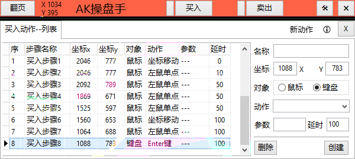
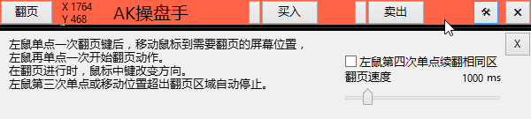
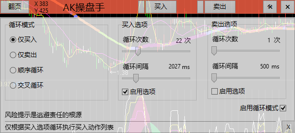

# AK操盘手

## AK是一款辅助软件，帮助用户改善交易环境。

### AK操盘手 version: 1.2.0

---
## AK操盘手软件的用途

AK操盘手把交易操作的多个动作步骤聚合成一个按键。AK自动模拟鼠标或键盘输入动作。

提升手工操作速度，根据行情需求执行一键买入或卖出按钮。多个交易动作瞬间完成。

## AK操盘手软件与量化软件区别

AK软件是基于常规用户交易软件的UI界面做出动作反映。速度受交易软件UI界面响应而变化。因此每一步少不了延时动作。
量化软件是基于程序命令行直接执行，速度非常快。
AK操盘手软件主要在于聚会多个鼠标和键盘操作动作。减少手工操作多个步骤的繁琐过程。

## 软件使用描述

需充分理解平时操作鼠键动作特点，并正确拆解动作步骤过程。
创建新步骤时，按Ctrl键输入新坐标。或双击列表复制已存在的坐标。
寻找最少，最佳步骤是重点。熟练应用单键(买入/卖出)再考虑循环交叉模式。
延时单位是毫秒(ms),按实际软件,硬件或网络响应速度确定必要延时值。
当按下买入或卖出键时，动作按列表中的坐标值改变鼠标位置，手工不要同时强行移动鼠标。

## 软件更新

下一个版本或增加多语言，期待用户反馈使用问题。

### AK操盘手功能:
AK软件主要用于股票交易软件的辅助操作，特点如下:
- 操作简单
- 文件小巧
- 绿色软件
- 仅两个文件
- 无网络连接
- 不收集用户数据

---

---

18 August 2024: version 1.1.0
- 第一个通用版本
19 August 2024: version 1.2.0
- 第2个通用版本
调整延时，修正通用版本的翻页与买卖按键同时切换导致的动作不匹配问题。
该版本可用于事务处理。平时手工操作需要5秒~10秒以上的交易步骤，使用AK操盘手只需1秒内完成所有动作。
